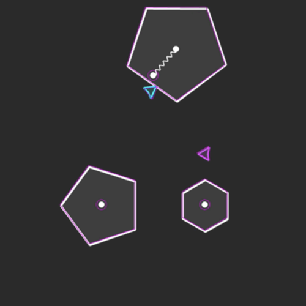

# PhaserTemplate

Get started quickly with PhaserJS 3, MatterJS physics, physics joints, and local multiplayer.

# How to Use

1. `Clone` this repo.
2. Serve `index.html` on localhost.
3. Both ships should control with `WASD` and `Arrow Keys`.   

# Live Demo

Try the [Live Demo](#)

# Screenshot

